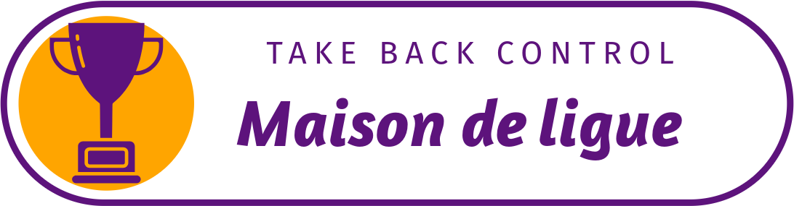

[Page déployée](https://georges-lucas.github.io/maison-des-ligue/)

# Intranet – Maison de Ligue

## Contexte

Le projet **Intranet – Maison des Ligues** est un projet individuel dont l'objectif est de développer une plateforme interne permettant de faciliter les échanges et interactions entre collaborateurs au sein d'une société en pleine expansion. En tant que développeur Front-End, vous êtes responsable du développement de la partie frontale de cette plateforme, sous forme de prototype graphique.

## Objectif

L'objectif principal de ce projet est de concevoir une interface utilisateur intuitive permettant aux collaborateurs de se connecter, d’interagir avec leurs collègues et d’accéder à différentes informations liées à l'organisation. Le projet comprend également un rôle d'administrateur pour gérer les collaborateurs.

## Stack Technique

- **Front-End** : HTML, CSS, JavaScript, PHP

## Fonctionnalités

### A. Utilisateur Standard :

1. **Connexion** : L'utilisateur se connecte avec son identifiant et mot de passe.
2. **Page d'accueil** : Une fois connecté, l'utilisateur arrive sur la page d'accueil qui lui présente un collaborateur au hasard. Un bouton permet d'afficher un autre collaborateur au hasard.
3. **Liste des Collaborateurs** : L'utilisateur peut accéder à la liste des collaborateurs via le menu. Les collaborateurs sont affichés sous forme de fiches, contenant leurs informations détaillées (nom, localisation, catégorie, etc.).
   - **Filtres** : Un système de filtres permet de trier la liste des collaborateurs par nom, localisation et catégorie.
   - **Mise à jour instantanée** : La liste se rafraîchit instantanément lors de chaque modification de filtre.
4. **Modification des Informations Personnelles** : L'utilisateur peut modifier ses informations personnelles en cliquant sur son image de profil dans le header (y compris son login et mot de passe).
5. **Déconnexion** : L'utilisateur peut se déconnecter. Après déconnexion, il est redirigé vers la page de connexion et ne peut plus accéder aux pages précédentes.

### B. Administrateur :

1. **Ajout de Collaborateurs** : L'administrateur peut ajouter un nouveau collaborateur via un formulaire simple.
2. **Modification d'un Collaborateur** : L'administrateur peut modifier les informations d'un collaborateur existant grâce à un bouton "Éditer" présent sur chaque fiche.
3. **Suppression d'un Collaborateur** : L'administrateur peut supprimer un collaborateur de la liste via un bouton "Supprimer" sur chaque fiche.
4. **Assignation de Rôle d'Administrateur** : Lors de la modification des informations d'un collaborateur, l'administrateur peut lui attribuer le rôle d'administrateur.
